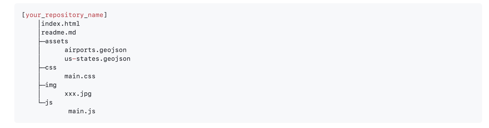
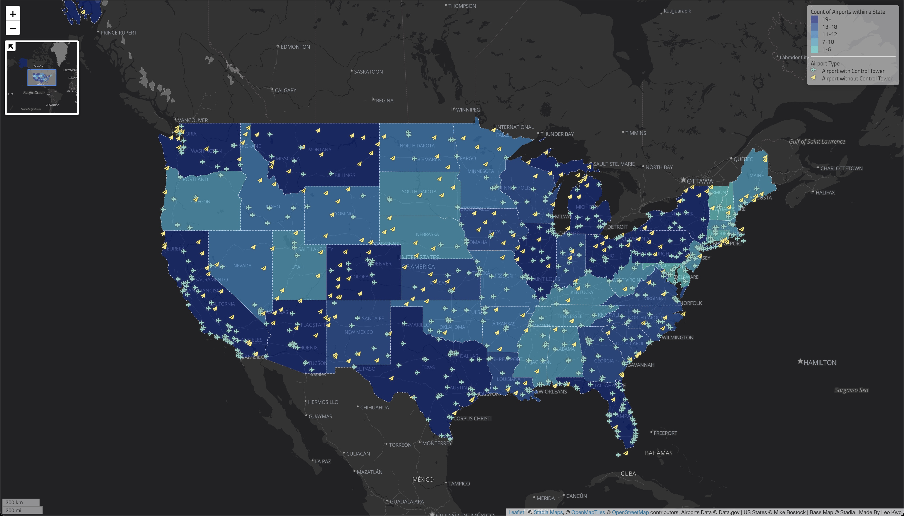

# GEOG 458 Lab 3: Mapping Airports in the United States

**- Leo Kwo**

This is the repository for GEOG 458 lab 3.

Here's the file structure of this repo:

### Exported Map
Here's the map generated using with the data provided:

###Important Information:

This project maps all airports in the United States. It provides information such as airport name, whether or not an airport has a control tower, and the quantile count of airports in each state.

The map features popups when clicking on any airport, which would reveal the name of the airport, and whether it has a control tower. This distinction is also shown through the different icons used to represent airports with or without control tower. For easier navigation, the map features a minimap located in the topleft corner. It shows the full extent of the map and users can click on it to quickly navigate around the map.

This map is created using **leaflet.js**, **leaflet.ajax**, **Chroma.js**, **jquery**, **Font Awesome**, and **leaflet.minimap**.

- Basemap used is [Stadia.AlidadeSmoothDark](https://leaflet-extras.github.io/leaflet-providers/preview/#filter=Stadia.AlidadeSmoothDark).

- Airport data used was downloaded and unzipped from [here](https://catalog.data.gov/dataset/usgs-small-scale-dataset-airports-of-the-united-states-201207-shapefile).

- State data used was acquired from [Mike Bostock](https://bost.ocks.org/mike/) of D3.
